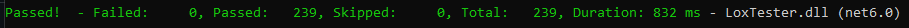
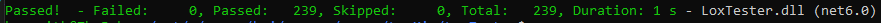

[//]: # (Hey!! This document is best viewed on GitHub: https://github.com/resistiv/LoxMin)

# LoxMin
LoxMin is a C implementation of the Lox bytecode virtual machine from the book [*Crafting Interpreters* by Robert Nystrom](https://craftinginterpreters.com/). This project was developed primarily as an assignment for CS 403/503 - Programming Languages (Fall 2023) at the University of Alabama. During development, I mostly followed the direction of the book, changing function and variable names where I saw fit, alongside reorganizing the folder structure of the repository.

LoxMin has been tested on Windows 10 and Ubuntu 22.04.

## Usage
When run without an argument, LM operates as a <abbr title="read-eval-print loop">REPL</abbr> prompt which runs until it encounters an exit code. Otherwise, when given a Lox source file, LM will attempt to execute it and then exit.
```
LoxMin [Lox script]
```

## Building
Building LoxMin requires a C compiler, such as gcc. It can be installed via a package manager, such as ``apt``.
```
sudo apt install build-essential
```
On Windows, it can be installed via Cygwin and mingw/mingw-w64 [here](https://cygwin.com/install.html). Particular instructions for mingw-w64 are available [here](https://www.mingw-w64.org/downloads/#cygwin).

Once installed, clone the repository to a location of your choosing.
```
git clone https://github.com/resistiv/LoxMin.git
```
Navigate to the ``LoxMin`` folder and run the following:
```
make
```
The resulting executable will be built to the ``LoxMin`` folder, from which it can be run.

## Testing
This repository makes use of [Robert Nystrom's Lox unit tests](https://github.com/munificent/craftinginterpreters/tree/master/test), excluding benchmarks.
For ease of generation, all unit test classes are generated using the ``LoxTestGenerator`` project.

For even easier use, two scripts are provided for Unix (``LoxTester/BuildTests.sh``) and Windows (``LoxTester/BuildTests.bat``) to generate the test cases classes for the ``LoxTester`` project. Both scripts will:
- Build the ``LoxTester`` solution to ensure ``LoxTestGenerator`` is built.
- Run ``LoxTestGenerator``, loading tests from ``LoxTester/LoxTester/Tests`` and outputting to ``LoxTester/LoxTester``.
- Build the solution again to incorporate the newly generated tests.

Run the appropriate script in the ``LoxTester`` directory to build the tests and run the following to run the test cases:
```
dotnet test
```
The number of successful and failed tests will be displayed.
**Of important note, LoxMin must be built in-place in its subdirectory, as the test harness will specifically search in that location for the executable.**

As of commit ``2e91c39``, everything builds, runs, and all tests pass on Windows 10 and Ubuntu 22.04.


As an aside, while a C implementation of Lox is very efficient, this testing suite is not. Instead of interfacing with the actual C code and keeping one running process throughout, each test spawns a LoxMin process which runs code and exits. Needless to say, this creates a lot of overhead, and so the runtime of these tests is not indicative of the final optimization or speed of LoxMin.
